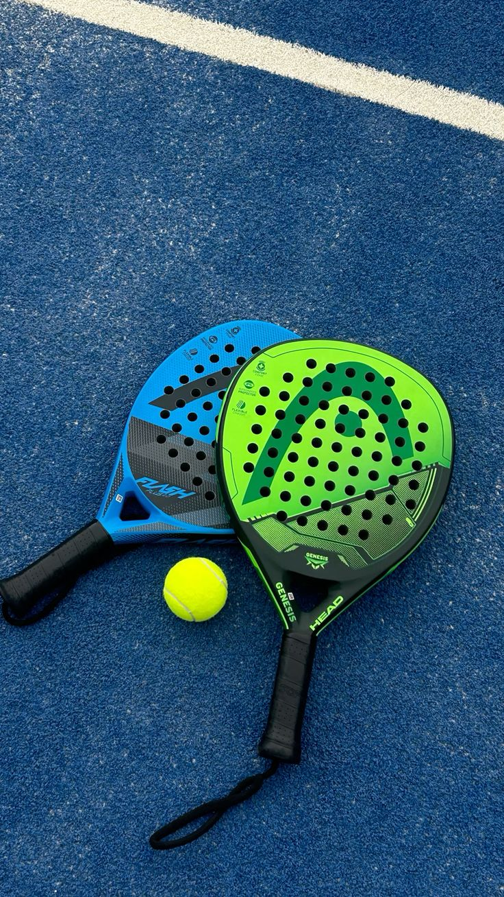

  
  <h1>MainPadel Booking Platform</h1>
  
A modern, real-time court reservation system built with Next.js & Supabase.

---

## 🌟 Overview

**MainPadel** is an elegant and lightning-fast web application designed specifically for padel sports clubs. It allows customers to book courts, rent rackets, and check schedules in real-time. On the backend, an administrative dashboard tracks live statistics, incoming bookings, and manages inventory.

### ✨ Key Features

- **Real-Time Booking System:** Customers can seamlessly select dates, courts, and time slots.
- **Racket Rentals:** Add-on feature allowing customers to rent multiple rackets during their session.
- **WhatsApp Integration:** Built-in "Check Booking" feature allowing users to monitor their reservation status using their phone number.
- **Live Admin Dashboard:** Powered by Supabase Realtime, the admin dashboard updates instantaneously the second a checkout occurs.
- **Responsive Architecture:** Fully optimized for both Desktop and Mobile experiences with distinct interfaces.
- **Beautiful UI/UX:** Crafted with Tailwind CSS and Framer Motion for buttery-smooth micro-animations.

## 📸 Screenshots

<b>Desktop Display</b> (Click to expand)

 

> *The landing page and booking view feature an immersive layout with dynamic sticky sidebars.*

 

<b>Mobile Experience</b> (Click to expand)

 

> *Centered interactions, stackable cards, and full-width touch areas guarantee a perfect mobile booking flow.*

 

## 🚀 Tech Stack

- **Framework:** [Next.js 15 (App Router)](https://nextjs.org/)
- **Styling:** [Tailwind CSS](https://tailwindcss.com/)
- **Animations:** [Framer Motion](https://www.framer.com/motion/)
- **Database & Auth:** [Supabase](https://supabase.com/)
- **Icons:** [Lucide React](https://lucide.dev/) / Custom SVGs

## ⚙️ How to Deploy (Vercel)

This application is fully prepared for Vercel deployment.

1. Push this code to your GitHub repository.
2. Go to your [Vercel Dashboard](https://vercel.com/dashboard) and click **Add New > Project**.
3. Import the `main-padel` repository.
4. **Environment Variables:** During the import step, copy the variables from your local `.env.local` into the Vercel Environment Variables section:
   - `NEXT_PUBLIC_SUPABASE_URL`
   - `NEXT_PUBLIC_SUPABASE_ANON_KEY`
5. Click **Deploy**. Vercel will automatically build and publish your site! 🚀

## 👨‍💻 Database Schema (Supabase)

If setting this up on a fresh Supabase project, ensure you have the following tables initialized:
- `courts` (id, name, description, price_per_hour, image_url, status)
- `rackets` (id, name, price_per_hour, available, image_url)
- `bookings` (id, customer_name, customer_phone, customer_email, court_id, booking_date, start_time, racket_id [JSON], total_price, status)
- `products` (id, name, description, category, price, stock, image_url, status)

*(Make sure to disable RLS or set up open policies depending on your usage, and remove the `racket_id` Foreign Key constraint from the bookings table to allow JSON arrays.)*
