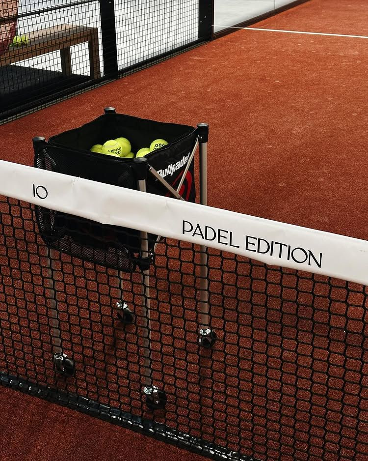

  
  <h1>Platform Reservasi MainPadel</h1>
  
Sistem reservasi lapangan padel modern dan real-time yang dibangun dengan Next.js dan Supabase.

---

## Ringkasan

MainPadel adalah aplikasi web elegan yang dirancang khusus untuk klub olahraga padel. Aplikasi ini memungkinkan pelanggan untuk memesan lapangan, menyewa raket, dan memeriksa jadwal secara langsung. Di sisi backend, dashboard administratif melacak statistik langsung, pesanan masuk, dan mengelola inventaris.

### Fitur Utama

- Sistem Reservasi Real-Time: Pelanggan dapat memilih tanggal, lapangan, dan slot waktu dengan lancar.
- Penyewaan Raket: Fitur tambahan yang memungkinkan pelanggan menyewa beberapa raket selama sesi mereka.
- Integrasi WhatsApp: Fitur Cek Booking memungkinkan pengguna memantau status reservasi mereka menggunakan nomor telepon.
- Dashboard Admin Langsung: Didukung oleh Supabase Realtime, dashboard admin diperbarui secara instan saat terjadi transaksi.
- Arsitektur Responsif: Dioptimalkan sepenuhnya untuk pengalaman Desktop dan Mobile dengan antarmuka yang berbeda.
- Antarmuka Pengguna Berkualitas: Dibangun dengan Tailwind CSS dan Framer Motion untuk animasi yang halus.

## Dokumentasi Visual

### Tampilan Desktop

Antarmuka beranda dan pemesanan menampilkan tata letak imersif dengan bilah sisi yang dinamis. 
*(Anda dapat mengganti foto ini dengan menyimpan screenshot web Anda ke folder `public/images/desktop-view.jpg`)*

### Pengalaman Mobile

Interaksi terpusat, kartu yang dapat ditumpuk, dan area sentuh lebar memastikan alur pemesanan seluler yang sempurna.
*(Anda dapat mengganti foto ini dengan menyimpan screenshot HP Anda ke folder `public/images/mobile-view.jpg`)*

## Teknologi

- Framework: Next.js 15 (App Router)
- Gaya: Tailwind CSS
- Animasi: Framer Motion
- Database dan Autentikasi: Supabase
- Ikon: Lucide React / SVG Kustom

